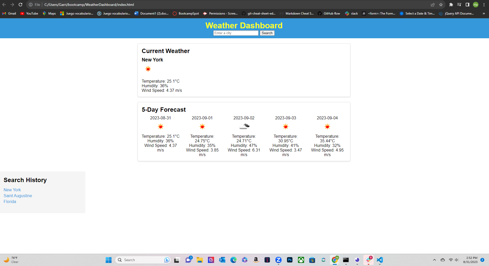

# WeatherDashboard
The weather dashboard is a web application that provides real time weather information for cities. Users can enter a city name in the search box and a 5-day forecast, with temperature, humidity, and wind speed details. My motivation for creating this website is to help those who have plans, but also need to see if the weather affects them.

## User Story
AS A traveler
I WANT to see the weather outlook for multiple cities
SO THAT I can plan a trip accordingly

## Resources
https://developer.mozilla.org/en-US/docs/Web/CSS/grid-template-columns - used to help with website's styling.
https://www.taniarascia.com/ , https://www.youtube.com/watch?v=cuEtnrL9-H0- assisted me with linking/fetching api.
https://medium.com/ - used to help me understand const and let.
https://home.openweathermap.org/ - weather api
Other resources listed below - https://medium.com/, https://www.youtube.com/, https://www.w3schools.com/, https://stackoverflow.com/

## Picture 

## Deployed application link
https://ronithenewcoder.github.io/WeatherDashboard/